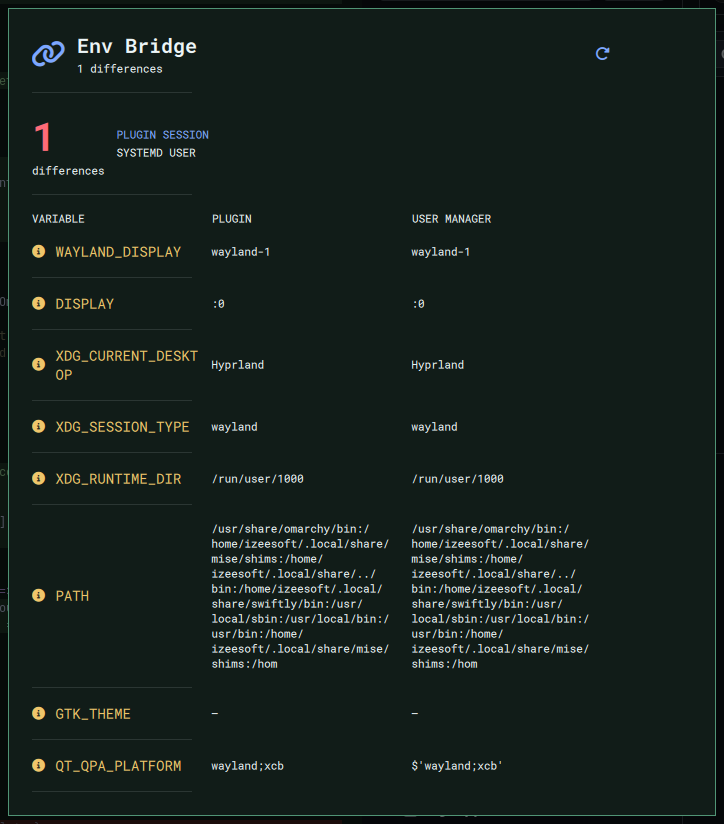

# Env Bridge

[](https://github.com/AdamMusa/omarchy-ui)
[](LICENSE)

**Compare the environment seen by desktop apps with the systemd user manager.**

Env Bridge compares a strict non-secret allowlist of display, toolkit, runtime, and PATH variables between the plugin session and the systemd user manager.



## Why this is distinct

Environment Passport inventories project toolchains. Env Bridge diagnoses the session boundary that makes a command work in a terminal but fail from a launcher or desktop service.

The concept was checked against the complete Omarchy Plugin Marketplace catalog before development.

## Install

```bash
omarchy plugin add https://github.com/AdamMusa/omarchy-env-bridge.git --enable
```

Review third-party plugin code before enabling it. Omarchy community plugins run with your user account.

## Use

Add **Env Bridge** to the Omarchy bar and click its widget to open the panel. The plugin is keyboard-friendly, theme-aware, and designed for a 660 × 760 panel.

## Data, permissions, and safety

- Local state: `~/.local/state/omarchy-env-bridge/state.json`
- State, command output, item counts, history, and rendered strings are bounded.
- State writes use an owner-only temporary file and atomic rename.
- System probes are read-only and invoke fixed argument arrays without a shell.
- No telemetry, analytics, remote account, package installation, or privileged command is used.
- The plugin never overwrites Omarchy, Hyprland, or application configuration.

External runtime tools are limited to standard commands already present on Omarchy when a feature needs them. Missing optional commands degrade to an explicit unavailable state. The exact commands are visible in [`lib/backend.rb`](lib/backend.rb).

## Remove

```bash
omarchy plugin remove izeesoft.env-bridge
```

Removal leaves the local state file in place so reinstalling preserves history. To erase it too:

```bash
rm -r ~/.local/state/omarchy-env-bridge
```

## Marketplace metadata

- Plugin ID: `izeesoft.env-bridge`
- Category: Developer Tools
- Tags: system, quickshell, bar
- Kinds: service, bar widget, panel
- Target: Omarchy Quattro on x86-64 Linux

## Development

The user interface is written entirely in Ruby with [Omarchy UI](https://github.com/AdamMusa/omarchy-ui). Generated QML bridge files and the attested mruby runtime are distribution artifacts.

```bash
sha256sum --check omarchy-ui-runtime.sha256
ruby test/backend_test.rb
omarchy plugin validate .
```

Runtime provenance and independent verification steps are documented in [`RUNTIME_PROVENANCE.md`](RUNTIME_PROVENANCE.md).

## License

MIT.
